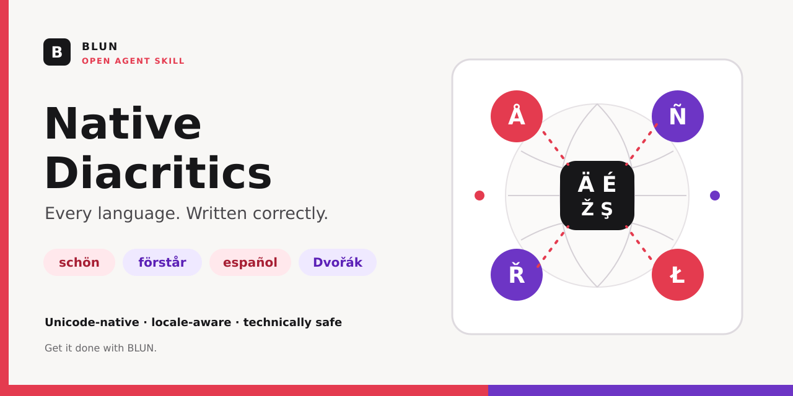

<p align="center">
  
</p>

<div align="center">

<pre>
 ____  _     _   _ _   _
| __ )| |   | | | | \ | |
|  _ \| |   | | | |  \| |
| |_) | |___| |_| | |\  |
|____/|_____|\___/|_| \_|
</pre>

# Native Diacritics

### AI should write every language like it belongs there.

One universal agent skill for correct Unicode characters, native spelling, alphabets, and punctuation across all languages.

<p>
  
  
  
  
  
</p>

**Built by BLUN · Get it done with BLUN.**

</div>

---

> **`schön`, not `schoen`. `förstår`, not `forstar`. `español`, not `espanol`. `Dvořák`, not `Dvorak`.**

AI agents are excellent at language, yet still flatten native characters into ASCII, lose accents, romanize entire writing systems, or silently damage names. Native Diacritics turns correct orthography into a mandatory output gate.

## One rule. Every language.

The skill requires agents to:

- preserve every language-specific letter, accent, combining mark, and punctuation mark;
- use native writing systems instead of unnecessary romanization;
- respect locale-specific orthography such as German `ß` versus Swiss German `ss`;
- verify uncertain spellings instead of inventing accents;
- normalize generated text to Unicode NFC;
- protect code, URLs, paths, API fields, identifiers, and exact quotations;
- recheck every answer and text file before delivery.

## Before and after

| Language | Broken ASCII output | Native output |
| --- | --- | --- |
| German | `Schoene Gruesse aus Koeln` | `Schöne Grüße aus Köln` |
| Swedish | `Vi ses i Goteborg och Malmo` | `Vi ses i Göteborg och Malmö` |
| Spanish | `Informacion para el senor` | `Información para el señor` |
| Czech | `Cestina, Dvorak` | `Čeština, Dvořák` |
| Portuguese | `Sao Paulo e coracao` | `São Paulo e coração` |
| Polish | `Lodz, jezyk, dziekuje` | `Łódź, język, dziękuję` |
| Turkish | `Istanbul, Turkce` | `İstanbul, Türkçe` |
| Vietnamese | `Tieng Viet, cam on` | `Tiếng Việt, cảm ơn` |

Technical values stay untouched:

```text
schoen_fuer_api
https://example.com/fuer-dich
/system/ueber/config
```

## Global coverage

| Coverage | Examples |
| --- | --- |
| Germanic languages | German, Swedish, Danish, Norwegian, Icelandic, Dutch |
| Romance languages | Spanish, French, Portuguese, Italian, Catalan, Romanian |
| Central and Eastern Europe | Czech, Slovak, Polish, Hungarian, Croatian, Bosnian, Serbian, Slovenian |
| Baltic and Nordic languages | Latvian, Lithuanian, Finnish, Estonian |
| Extended Latin scripts | Turkish, Azerbaijani, Vietnamese, Albanian, Maltese, Irish |
| Native alphabets | Greek, Cyrillic, Armenian, Georgian |
| Right-to-left scripts | Arabic, Persian, Urdu, Hebrew |
| Indic and Southeast Asian scripts | Devanagari, Bengali, Tamil, Thai, Lao, Khmer, Myanmar |
| East Asian scripts | Chinese, Japanese, Korean |

The rule is not limited to this table. It applies to **every human language and writing system**.

## How the gate works

1. **Detect** the language and locale of every natural-language segment.
2. **Write** with native characters, spelling, script, and punctuation.
3. **Protect** technical values and exact source material.
4. **Verify** the complete result before marking the task finished.

Confirmed violations block completion. A clean automated scan never replaces the final linguistic review.

## Install

Clone the repository:

```bash
git clone https://github.com/Maykbiletti/native-diacritics.git
```

Copy the `native-diacritics` folder into the skill directory used by your compatible agent platform, or load its [`SKILL.md`](native-diacritics/SKILL.md) according to that platform's skill instructions.

Invoke it explicitly when needed:

```text
$native-diacritics
```

Its metadata also permits implicit activation for natural-language writing, translation, rewriting, proofreading, documentation, UI copy, and text-file tasks.

## Deterministic file check

The bundled zero-dependency Python linter flags frequent ASCII transliterations and malformed Unicode in UTF-8 prose files.

```bash
python3 native-diacritics/scripts/check_diacritics.py --language de text.md
python3 native-diacritics/scripts/check_diacritics.py --language sv text.md
python3 native-diacritics/scripts/check_diacritics.py --language es text.md
python3 native-diacritics/scripts/check_diacritics.py --language cs text.md
python3 native-diacritics/scripts/check_diacritics.py --language all text.md
```

The linter masks fenced code, inline code, URLs, and email addresses before scanning.

## Repository structure

```text
native-diacritics/
├── SKILL.md
├── agents/
│   └── openai.yaml
├── assets/
│   └── icon.svg
├── references/
│   └── language-guide.md
└── scripts/
    └── check_diacritics.py
```

The repository additionally includes automated tests and a GitHub Actions workflow.

## Test

```bash
python3 -m unittest discover -s tests -v
```

Current test coverage verifies:

- correct multilingual text;
- German transliterations;
- Spanish transliterations;
- Czech transliterations;
- technical-span protection.

## Design principle

Native spelling is not decoration. A missing mark can change pronunciation, meaning, identity, search results, and trust. The skill therefore treats native orthography as a correctness requirement, not an optional style preference.

The linter is intentionally conservative because no static word list can understand every sentence. The mandatory agent-side review provides the global rule; the script adds deterministic protection for frequent mistakes.

## License

Released under the [MIT License](LICENSE).

---

<div align="center">

### Built European. Built to communicate.

**BLUN**

*Get it done with BLUN.*

</div>
